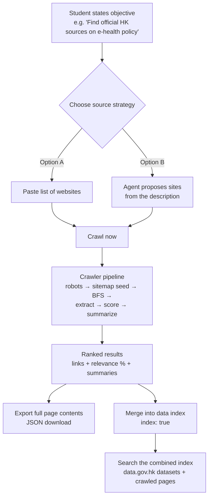

# Expected workflow and outcome

## 1. User-facing workflow (Search Pilot at search.simonsays.hk/pilot)

### Step-by-step

1. **State the objective.** Plain language, e.g. "Find official Hong Kong
   government sources about e-health record policy for my LegCo report."
2. **Choose sites (Option A)** — paste URLs of sites the student/team selected;
   or **let the agent propose (Option B)** — the pilot maps the description to
   known HK gov/open-data sources (legco, gov.hk, edb, data.gov.hk, …).
3. **Crawl.** The engine (this repo) runs the thorough pipeline. Typical
   outcomes: static sites finish in seconds; JS-rendered SPAs (LegCo) need
   headless Chromium and take ~1 min for 15 pages; first crawl on a fresh
   container adds ~1–2 min one-off chromium self-install.
4. **Read ranked results.** Each result: distinct link, relevance %, and a
   short summary explaining the match. Full page text is included in exports.
5. **Export or index.** Download JSON (objective + all results + full text)
   for downstream processing (analysis, RAG, report writing); or `index: true`
   merges pages into the shared index.

### Expected outcome vs pure search engines / AI chatbots

| Dimension | Google / chatbot | AgenticSearch pilot |
|-----------|------------------|---------------------|
| Coverage | What's indexed & popular | Everything crawlable on the named sites, incl. deep pages |
| Transparency | Black-box ranking | Every step visible: sites → pages → scores → summaries |
| Output | Links / blended answer | Per-page relevance + summary + **full extracted text** |
| Reusability | Read-only | Index + exports feed further analysis |

## 2. Developer workflow (this repo)

1. **Change** — follow `skills/modular-dev.md`: behaviour goes in the owning
   module; `server.mjs` stays a thin HTTP shell.
2. **Test locally** — `npm test` (unit) and `npm run test:regression`
   (7 known production bugs + HTML fixtures) must pass before commit.
3. **Deploy** — `railway up --service agenticsearch` (project: gcap3056).
4. **Verify** — `BASE_URL=<deploy-url> npm run test:e2e` must be ALL PASS
   before announcing the deploy.
5. **Re-index** — after content-affecting changes, re-run
   `POST /api/index/build` (data.gov.hk) and re-crawl key sites with
   `index: true`.

## 3. Frontend integration

The Search Pilot frontend (GCAP3056/frontend) proxies `/api/crawl` and
`/api/index/*` to this service via `AGENTICSEARCH_URL`
(`http://agenticsearch.railway.internal:8080`). If the engine is unreachable,
the frontend falls back to its built-in minimal implementation so the pilot
never hard-fails during class.
